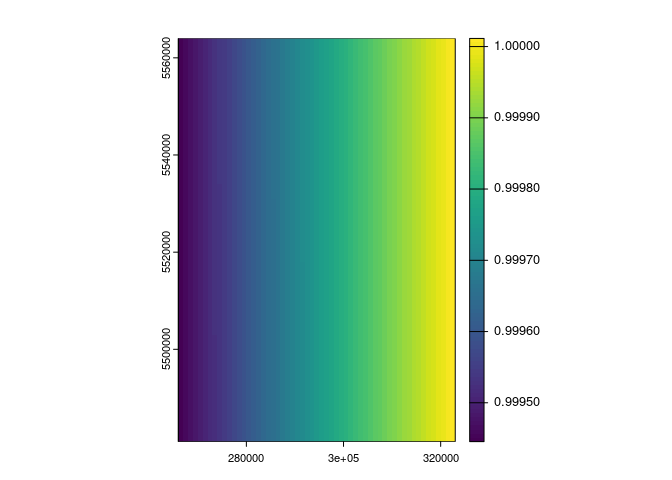
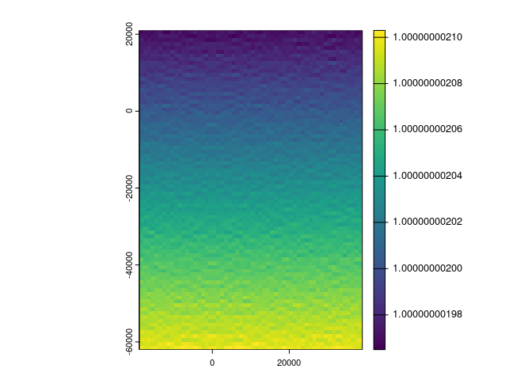

<!-- README.md is generated from README.Rmd. Please edit that file -->

# realarea

<!-- badges: start -->
<!-- badges: end -->

The goal of realarea is to provide helpers to determine the actual area
covered and the calculated area vs the “real” geographic area
represented in a projected raster.

## Installation

You can install the development version of realarea like so:

``` r
remotes::install_github("hypertidy/realarea")
```

## Example

We have a shapefile and we want to assess suitability of a given map
projection.

``` r
library(realarea)

luxshp <- system.file("ex/lux.shp", package="terra", mustWork = TRUE)
lux <- terra::vect(luxshp)
```

With `crs_grid()` we can create a suitable raster grid from that vector
data set.

By default we just get a nice grid from it in the native crs.

``` r
crs_grid(lux)
#> class       : SpatRaster 
#> dimensions  : 380, 400, 1  (nrow, ncol, nlyr)
#> resolution  : 0.002, 0.002  (x, y)
#> extent      : 5.74, 6.54, 49.44, 50.2  (xmin, xmax, ymin, ymax)
#> coord. ref. : lon/lat WGS 84 (EPSG:4326) 
#> source(s)   : memory
#> name        : layer 
#> min value   :     1 
#> max value   :     1
```

But specify an actual map projection and we can get some more benefit,
and with ‘res’ we can get exactly what we want: a raster from which we
can calculate real-world area (with `terra::expanse()`) and compare that
with the nominal cell size which is `prod(res(<x>))`.

``` r
crs <- "EPSG:23032"
crs_grid(lux, crs = crs)
#> class       : SpatRaster 
#> dimensions  : 520, 360, 1  (nrow, ncol, nlyr)
#> resolution  : 160, 160  (x, y)
#> extent      : 265600, 323200, 5481600, 5564800  (xmin, xmax, ymin, ymax)
#> coord. ref. : ED50 / UTM zone 32N (EPSG:23032) 
#> source(s)   : memory
#> name        : layer 
#> min value   :     1 
#> max value   :     1
```

``` r

luxutm1000 <- crs_grid(lux, crs = crs, res = 1000)
luxaea1000 <- crs_grid(lux, crs = "+proj=aea +lon_0=6 +lat_0=50 +lat_1=50.1 +lat_2=49.4", res = 1000)
```

What is the total area of the input polygon?

What do we get from the two projections?

``` r
library(terra)
#> terra 1.7.81
```

``` r

polyarea <- sum(expanse(lux))
sqrt(polyarea)
#> [1] 50643.96
```

``` r
utmarea <- sum(values(mask(cellSize(luxutm1000), luxutm1000)), na.rm = TRUE)
sqrt(utmarea)
#> [1] 50589.04
```

``` r


## this one is closest to the polygon area
aeaarea <- sum(values(mask(cellSize(luxaea1000), luxaea1000)), na.rm = TRUE)
sqrt(aeaarea)
#> [1] 50645.83
```

``` r

plot(cellSize(luxutm1000)/prod(res(luxutm1000)))
```



``` r

plot(cellSize(luxaea1000)/prod(res(luxaea1000)))
```



So, unsurprsingly the local Albers Equal Area Conic projection is a
better choice than UTM.

WIP

## Code of Conduct

Please note that the realarea project is released with a [Contributor
Code of
Conduct](https://contributor-covenant.org/version/2/1/CODE_OF_CONDUCT.html).
By contributing to this project, you agree to abide by its terms.
